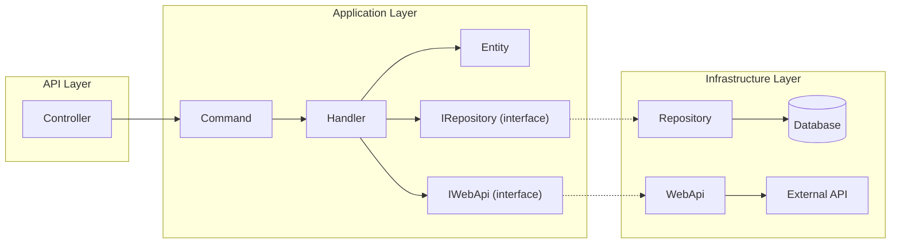
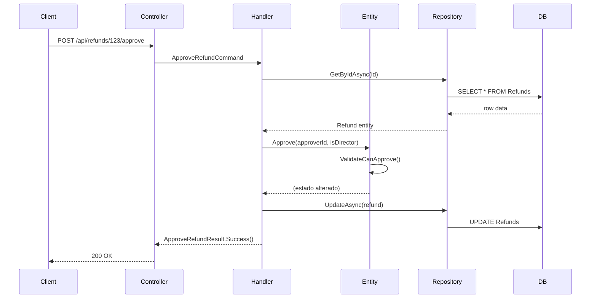

# DOCUMENTAÇÃO MESTRE: HERALD.TEMPLATE (MODELO RICO)

**Arquitetura, Estilo de Código e Diretrizes de Desenvolvimento - Versão Universal**

---

## Índice

- [Parte 1: Manifesto da Legibilidade e Estilo](#parte-1-manifesto-da-legibilidade-e-estilo)
  - [1.1 Princípio Absoluto](#11-princípio-absoluto)
  - [1.2 Nomenclatura](#12-nomenclatura)
  - [1.3 Funções: Código como Prosa](#13-funções-código-como-prosa)
  - [1.4 Variáveis e Estado](#14-variáveis-e-estado)
- [Parte 2: Padrões de Design (Gang of Four)](#parte-2-padrões-de-design-gang-of-four)
- [Parte 3: Arquitetura Herald (Estrutura)](#parte-3-arquitetura-herald-estrutura)
  - [3.1 Estrutura da Solução](#31-estrutura-da-solução-strict-semantic-folder-structure)
  - [3.2 Padronização de Nomes](#32-padronização-de-nomes-sufixos-explícitos)
  - [3.3 Proibições Arquiteturais](#33-proibições-arquiteturais-anti-patterns)
  - [3.4 Layer Supertype](#34-layer-supertype-martin-fowler)
- [Parte 4: Detalhamento das Camadas](#parte-4-detalhamento-das-camadas)
- [Parte 5: Estratégia de Implementação](#parte-5-estratégia-de-implementação)
  - [5.1 Validação](#51-validação-defense-in-depth)
  - [5.2 Fluxo de Controle no Handler](#52-fluxo-de-controle-no-handler-modelo-rico)
  - [5.3 Pipeline Behaviors](#53-pipeline-behaviors-infraestrutura-de-observabilidade)
  - [5.4 Result Pattern](#54-result-pattern-retorno-padronizado)
- [Parte 6: Modernidade por Linguagem](#parte-6-modernidade-por-linguagem)
- [Parte 7: Agregados](#parte-7-agregados)
  - [7.0 DDD no Herald: uso pragmático](#70-ddd-no-herald-uso-pragmático)
  - [7.1 Agregados (Aggregate Roots)](#71-agregados-aggregate-roots)
- [Parte 8: Mensageria (Messages / Events)](#parte-8-mensageria-messages--events)
  - [8.1 Consistência entre Banco e Mensageria](#81-consistência-entre-banco-e-mensageria)
- [Parte 9: Separação de Responsabilidades](#parte-9-separação-de-responsabilidades)
  - [9.1 O Que Vai Onde](#91-o-que-vai-onde)
  - [9.2 NUNCA Faça na Entidade](#92-nunca-faça-na-entidade)
- [Parte 10: Code Smells e Refatoração](#parte-10-code-smells-e-refatoração)
  - [10.1 Sinais de Alerta](#101-sinais-de-alerta)
  - [10.2 Refatorações Comuns](#102-refatorações-comuns)
- [Parte 11: Testing no Modelo Rico](#parte-11-testing-no-modelo-rico)
  - [11.1 Vantagens para Testes](#111-vantagens-para-testes)
  - [11.2 Testando Handlers](#112-testando-handlers)
- [Parte 12: Queries no Modelo Rico](#parte-12-queries-no-modelo-rico)
- [Parte 13: Exemplo End-to-End](#parte-13-exemplo-end-to-end)

---

## Quick Reference

**[OBRIGATÓRIO]** As 10 regras mais críticas:

1. **Legibilidade > Tudo** - Se você hesita ao ler, refatore imediatamente. [→ 1.1](#11-princípio-absoluto)
2. **Entidades são Ricas** - Propriedades privadas, mutação apenas via métodos de domínio. [→ 4.A.2](#2-entidades-entities---modelo-rico)
3. **Entidade NUNCA acessa infraestrutura** - Sem repositórios, APIs ou serviços dentro da entidade. [→ 9.2](#92-nunca-faça-na-entidade)
4. **Handler é orquestrador magro** - Busca, valida existência, delega para entidade, persiste. [→ 5.2](#52-fluxo-de-controle-no-handler-modelo-rico)
5. **Polimorfismo > Condicionais** - Switch/case de tipo → Strategy ou State Pattern. [→ Parte 2](#parte-2-padrões-de-design-gang-of-four)
6. **Funções pequenas** - Max 20 linhas, max 4 parâmetros, max 2 níveis de indentação. [→ 1.3](#13-funções-código-como-prosa)
7. **Constantes sempre** - Todo número mágico vira `SCREAMING_SNAKE_CASE`. [→ 1.2](#constantes-screaming_snake_case)
8. **Sufixos explícitos** - `Command`, `Query`, `Handler`, `Result`, `WebApi`. [→ 3.2](#32-padronização-de-nomes-sufixos-explícitos)
9. **Pastas semânticas** - `Infrastructure/WebApis/` (não `Services/`), `Infrastructure/Repositories/`. [→ 3.1](#31-estrutura-da-solução-strict-semantic-folder-structure)
10. **Imutabilidade prioritária** - Prefira `const`, `final`, `readonly`, `frozen`. [→ 1.4](#14-variáveis-e-estado)

---

# PARTE 1: MANIFESTO DA LEGIBILIDADE E ESTILO

## 1.1. PRINCÍPIO ABSOLUTO

**[OBRIGATÓRIO]** Minimizar tempo para entender o código.

Legibilidade > Brevidade > Performance > Originalidade.
Se você hesita ao ler, o código precisa ser refatorado.

## 1.2. NOMENCLATURA

### **Convenções de Nomenclatura**

- Nomes respondem: O que é? O que faz? Por que existe?
- Específico > Genérico. Descritivo > Conciso.
- **Evite nomes genéricos quando possível:** `data`, `info`, `manager`, `handler`, `process`, `temp`, `aux`, `helper`, `util`.
- Se usar nome genérico, combine com contexto específico: `UserManager`, `DateUtil`, `PaymentHandler`.
- Booleanos: `is`, `has`, `can`, `should`. **Proibido negações** (`disableSsl = false`).

### **Constantes: SCREAMING_SNAKE_CASE**

**[OBRIGATÓRIO]** Todas letras maiúsculas separadas por underscore (\_).

- Extrair TODO número mágico sem exceção.
- Constante age como documentação viva.

```python
# ✅ BOM
MAX_LOGIN_ATTEMPTS = 3
DEFAULT_TAX_RATE = 0.15

# ❌ RUIM
maxLoginAttempts = 3
if status == 2: ... # O que é 2?
```

### **Convenções de Código (Adapte à linguagem)**

| Linguagem      | Classes/Tipos | Métodos/Funções | Variáveis  | Constantes      |
| :------------- | :------------ | :-------------- | :--------- | :-------------- |
| **Python**     | PascalCase    | snake_case      | snake_case | SCREAMING_SNAKE |
| **JavaScript** | PascalCase    | camelCase       | camelCase  | SCREAMING_SNAKE |
| **Java**       | PascalCase    | camelCase       | camelCase  | SCREAMING_SNAKE |
| **Rust**       | PascalCase    | snake_case      | snake_case | SCREAMING_SNAKE |
| **C#/.NET**    | PascalCase    | PascalCase      | camelCase  | SCREAMING_SNAKE |
| **PHP**        | PascalCase    | camelCase       | camelCase  | SCREAMING_SNAKE |
| **Ruby**       | PascalCase    | snake_case      | snake_case | SCREAMING_SNAKE |

## 1.3. FUNÇÕES: CÓDIGO COMO PROSA

- Função principal narra a história (alto nível).
- Funções auxiliares fornecem detalhes (baixo nível).
- **[OBRIGATÓRIO]** Max 20 linhas (ideal 10), Max 4 parâmetros, Max 2 níveis de indentação.
- Uma função = Uma tarefa atômica.
- **[OBRIGATÓRIO]** Extrair função para:
  - Corpo de loop.
  - Bloco que precisa comentário.
  - Condições com 2+ operadores lógicos.
  - Blocos if/else > 3 linhas.

## 1.4. VARIÁVEIS E ESTADO

- Escopo mínimo. Declare imediatamente antes do uso.
- **[RECOMENDADO]** Prefira estruturas imutáveis (const, final, readonly, frozen).
- **[RECOMENDADO]** Expressões complexas → variáveis descritivas (Extract Variable).
- **[OBRIGATÓRIO]** NUNCA atribuir valores a parâmetros de entrada.

---

# PARTE 2: PADRÕES DE DESIGN (GANG OF FOUR)

**[OBRIGATÓRIO]** Polimorfismo > Condicionais.

Cada condicional de tipo é candidato a padrão. Prefira pecar pelo excesso que pela falta.

## Tabela de Decisão Rápida

| Sintoma no Código | Padrão Recomendado |
|:------------------|:-------------------|
| Switch/case ou if/else baseado em tipo de algoritmo | **Strategy** |
| Objeto tem 3+ estados com comportamentos diferentes | **State** |
| Criação de objetos com lógica complexa ou múltiplas variantes | **Factory Method** |

### **Strategy Pattern**

**QUANDO USAR:**

- 3+ algoritmos intercambiáveis para mesma tarefa.
- Comportamento varia em runtime baseado em contexto.
- Switch/case ou if/else baseado em tipo de algoritmo.

```python
# ✅ BOM
class PaymentStrategy(ABC):
    @abstractmethod
    def process(self, payment: Payment) -> None: ...

class CreditCardStrategy(PaymentStrategy):
    def process(self, payment: Payment) -> None: ...

class PixStrategy(PaymentStrategy):
    def process(self, payment: Payment) -> None: ...
```

### **State Pattern**

**QUANDO USAR:**

- Objeto tem 3+ estados distintos com comportamentos diferentes.
- Transições de estado são complexas.
- Condicionais de estado espalhados por múltiplas funções.

```javascript
// ✅ BOM
class OrderState {
  cancel(order) { throw new Error('Not implemented'); }
  ship(order) { throw new Error('Not implemented'); }
}

class PendingState extends OrderState { ... }
class ShippedState extends OrderState { ... }
```

### **Factory Method Pattern**

**QUANDO USAR:**

- Criação tem lógica complexa (validações, configurações).
- Múltiplas formas de criar mesmo tipo.
- Nome descritivo torna criação mais clara que construtor direto.

```csharp
// ✅ BOM
public static User CreateAdmin(string email)
{
    var user = new User { Email = email };
    user.SetRole(Role.Admin);
    return user;
}
```

---

# PARTE 3: ARQUITETURA HERALD (ESTRUTURA)

O Herald combina **Clean Architecture** com **Vertical Slices** e **CQRS**.

### Visão Geral do Fluxo



**Fluxo de uma Request:**

1. **Controller** recebe JSON e cria `Command`/`Query`.
2. **Handler** busca entidades via `IRepository` (interface).
3. **Handler** delega regras de negócio para **Entity**.
4. **Handler** chama APIs externas via `IWebApi` (interface).
5. **Repository** e **WebApi** (infraestrutura) implementam as interfaces.

#### 3.1. Estrutura da Solução (Strict Semantic Folder Structure)

A organização das pastas deve refletir os **Padrões Arquiteturais**, nunca a tecnologia subjacente.

```text
ProjectRoot/
├── Api/ ou Ui/                  # Entrada (Controllers, Pages, Middlewares)
├── Application/                 # Domínio + Regras de Negócio Puras (Entities, Features, Interfaces)
│   ├── Entities/                # Regras de Negócio Puras (Entidades/Value Objects)
│   │   ├── Shared/              # Value Objects reutilizáveis entre aggregates/módulos
│   │   │   ├── Money.cs
│   │   │   └── Email.cs
│   │   ├── Order/               # Aggregate Order (aggregate root + entidades internas)
│   │   │   ├── Order.cs         # Aggregate Root
│   │   │   └── OrderItem.cs     # Entidade agregada interna (não é shared)
│   │   └── ...
│   ├── Features/                # Casos de uso (Commands/Queries + Handlers)
│   ├── Interfaces/              # Contratos
│   │   ├── ICustomerRepository.cs
│   │   └── ...
│   └── ...
└── Infrastructure/              # Implementações Concretas (Infraestrutura Plugável)
    ├── Persistence/             # Núcleo técnico de persistência (ORM, DbContext, UoW, helpers)
    ├── Repositories/            # ✅ Implementação de Interfaces de Banco
    │   └── CustomerRepository.cs
    ├── Behaviors/               # Pipeline Behaviors genéricos (Logging, Metrics, etc.)
    │   ├── LoggingBehavior.cs
    │   └── MetricsBehavior.cs
    └── WebApis/                 # Integrações com Web APIs externas
        └── PaymentWebApi.cs
```

A pasta `Order/` no exemplo acima é opcional; em projetos menores é aceitável manter as entidades diretamente em `Application/Entities`, exceto os tipos de `Shared`, conforme detalhado na seção de Entidades.

Com essa estrutura, a pasta `Application/` permanece 100% focada em regras de negócio e casos de uso (sem logging, métricas, cache ou mensageria). Comportamentos transversais como logging e métricas vivem em `Infrastructure/Behaviors` (ou em uma pasta equivalente como `Infrastructure/CrossCutting`), como Pipeline Behaviors genéricos que podem ser reaproveitados em outros projetos.

**🚫 LISTA NEGRA DE PASTAS (Delete se existirem):**

| Pasta Proibida      | Por que é ruim?                                              | Onde deve estar?                                    |
| :------------------ | :----------------------------------------------------------- | :-------------------------------------------------- |
| `Data` / `Database` | Foca no armazenamento (tabela), não no acesso (repositório). | `Infrastructure/Repositories`                       |
| `Network` / `Http`  | Foca no protocolo, não no serviço de negócio.                | `Infrastructure/WebApis`                            |
| `Util` / `Common`   | "Gaveta da bagunça". Quebra SRP.                             | `Infrastructure/Extensions` ou `SharedKernel`       |
| `Models` / `Dto`    | Nomes genéricos.                                             | Use `Application/Commands` ou `Application/Results` |
| `Core`              | Ambíguo. Geralmente vira uma mistura de domínio e utils.     | Use `Application` explicitamente.                   |

---

### Por que isso é melhor? (Argumento para o Time)

A navegação no código se torna **previsível** através do espelhamento Interface \<-\> Implementação:

1.  O desenvolvedor vê na `Application`: `interface ISerasaWebApi`.
2.  Ele sabe intuitivamente que a implementação **não** está em `Infrastructure/Network/HttpClient.cs`.
3.  Ele sabe que **está** em `Infrastructure/WebApis/SerasaWebApi.cs`.

Você elimina a "caça ao tesouro" dentro do projeto.

## 3.2. Padronização de Nomes (Sufixos Explícitos)

A nomenclatura técnica define o papel do componente na arquitetura CQRS.

| Tipo         | Sufixo     | Definição                                      | Exemplo               |
| :----------- | :--------- | :--------------------------------------------- | :-------------------- |
| **Command**  | `Command`  | Intenção de Escrita. Mapeia o JSON de entrada. | `RegisterUserCommand` |
| **Query**    | `Query`    | Intenção de Leitura.                           | `GetStatementQuery`   |
| **Handler**  | `Handler`  | Orquestrador (Coordena entidades).             | `RegisterUserHandler` |
| **Result**   | `Result`   | DTO de retorno do Handler.                     | `GetStatementResult`  |
| **Request**  | `Request`  | DTO de envio para API Externa (Infra).         | `CreditScoreRequest`  |
| **Response** | `Response` | DTO de resposta de API Externa (Infra).        | `CreditScoreResponse` |
| **WebApi**   | `WebApi`   | Integração com Web APIs externas (Infra).      | `CreditScoreWebApi`   |

### 3.3. PROIBIÇÕES ARQUITETURAIS (ANTI-PATTERNS)

O uso dos seguintes padrões constitui violação imediata da arquitetura:

❌ DAO (Data Access Object):

Motivo: DAOs espelham tabelas do banco de dados e quebram o encapsulamento. O Herald utiliza Repositórios, que espelham coleções de Agregados.

Regra: Classes com sufixo DAO ou que exponham métodos de tabela (insert_table_x) são proibidas. Use Repository.

### 3.4. Layer Supertype (Martin Fowler)

O padrão **Layer Supertype** define uma superclasse comum para uma camada (por exemplo, todas as entities ou todos os repositories) concentrando comportamentos puramente transversais daquela camada.

**Use com moderação e somente quando houver repetição clara dentro da mesma camada.** Se a base não estiver eliminando código duplicado real, ela está aumentando o acoplamento à toa.

#### Quando considerar Layer Supertype

- Entidades compartilham exatamente o mesmo comportamento técnico (por exemplo, rastreamento de Domain Events ou timestamps).
- Repositórios de infraestrutura compartilham a mesma lógica técnica de persistência (por exemplo, acesso a ORM, transação, mapeamento genérico), sem depender de regras de negócio.
- Controllers da API compartilham apenas infraestrutura de tratamento de erro, versionamento ou logging, sem misturar regras de domínio.

#### Interface x Classe Base Abstrata x Layer Supertype

- **Interfaces**

  - Prefira para contratos de domínio e application (`repositories`, `services externos`, `handlers`).
  - Boas quando precisa permitir múltiplas implementações sem herança de comportamento.

- **Classe base abstrata**

  - Use para compartilhar comportamento comum estritamente técnico dentro da mesma camada.
  - Bom para repositórios genéricos na infraestrutura ou helpers de API base.
  - Não deve conhecer regras de negócio específicas de uma entidade/feature.

- **Layer Supertype**
  - É uma forma específica de classe base abstrata por camada.
  - Use apenas quando a camada realmente tem um “núcleo técnico” comum que reduz duplicação significativa.

#### Onde nunca usar

- Como superclasse de todas as entidades apenas para “ter um ponto comum” sem comportamento concreto.
- Para misturar lógica de múltiplos bounded contexts ou módulos na mesma base.
- Para empurrar regras de negócio genéricas para uma superclasse enorme.
- Como substituto de composição (quando na realidade deveria ser um serviço/colaborador separado).

#### Atenção a superclasses de frameworks

- Nunca force o Layer Supertype a competir com a superclasse oficial do framework (por exemplo, `ControllerBase`, `DbContext`, `Entity` de ORMs).
- Se o framework já impõe uma superclasse, priorize **interfaces + composição** em vez de herdar de múltiplas hierarquias.
- Se a linguagem/framework não suporta herança múltipla, não tente “imitar” isso com hierarquias profundas; prefira serviços auxiliares injetados.

---

# PARTE 4: DETALHAMENTO DAS CAMADAS

## A. application/ (O Coração)

### 1. Vertical Slices (Features)

Funcionalidades agrupadas por **Módulo** > **Feature**. Tudo que a feature precisa fica junto.

```text
Features/
├── Financial/              <-- Módulo
│   ├── IssueInvoice/       <-- Feature
│   │   ├── IssueInvoiceCommand.cs
│   │   ├── IssueInvoiceHandler.cs
│   │   └── IssueInvoiceResult.cs
```

Regras de nomenclatura de feature:

- Nome da pasta da feature é sempre **conceito de negócio**, nunca verbo CRUD-like (`Create`, `Update`, `Delete`).
- A estrutura de pastas segue **Módulo / Agregador ou Agregado / Feature**.
- Os arquivos dentro da pasta replicam o **nome base** da feature com o sufixo técnico:
  - Pasta `IssueInvoice/` → `IssueInvoiceCommand.cs`, `IssueInvoiceHandler.cs`, `IssueInvoiceResult.cs`.
  - Classes: `IssueInvoiceCommand`, `IssueInvoiceHandler`, `IssueInvoiceResult`.
- Evite pastas genéricas como `customer_crud/`, `order_operations/`. Prefira conceitos como `open_account/`, `close_account/`, `issue_invoice/`.

### 2. Entidades (Entities) - MODELO RICO

Local base: `Application/Entities`.

`Application/Entities` é o guarda-chuva do **modelo de domínio rico**. Aqui vivem tanto Entities quanto Value Objects; a distinção é conceitual (identidade x igualdade por valor), não de pasta.

Uma organização recomendada é:

```text
Application/
  Entities/
    Shared/           # Value Objects reutilizáveis entre aggregates/módulos
      Money.cs
      Email.cs

    Order/            # Aggregate Order (aggregate root + entidades internas)
      Order.cs        # Aggregate Root
      OrderItem.cs    # Entidade agregada interna (não é shared)
```

`Shared` é opcional, mas recomendado para concentrar Value Objects reutilizáveis (como `Money`, `Email`, `Cpf`). Subpastas com o nome do aggregate root (como `Order/`) também são opcionais; em projetos menores é aceitável manter todas as entidades diretamente em `Application/Entities`, exceto os tipos de `Shared`.

**Responsabilidade:** Proteger suas próprias invariantes através de métodos de domínio, mantendo estado e comportamento juntos (OO clássico).

**Características:**

- Propriedades **privadas** (ou protegidas).
- Mutação **apenas** através de métodos públicos.
- Métodos validam regras de negócio antes de mudar estado.
- **NUNCA** acessam infraestrutura (ver [Parte 9.2](#92-nunca-faça-na-entidade) para detalhes).

**Inicialização e Getters:**

```python
class Refund:
    def __init__(self, amount: float, requester_id: str):
        self._id: Optional[str] = None
        self._amount: float = amount
        self._status: Status = Status.PENDING
        self._requester_id: str = requester_id
        self._approver_id: Optional[str] = None
        self._approved_at: Optional[datetime] = None
        self._validate_creation()

    @property
    def amount(self) -> float:
        return self._amount

    @property
    def status(self) -> Status:
        return self._status
```

**Métodos de Domínio (única forma de mutação):**

```python
    # Métodos de Domínio (única forma de mutação)
    def approve(self, approver_id: str, is_director: bool) -> None:
        if self._status != Status.PENDING:
            raise DomainException("Only pending refunds can be approved")
        if self._amount > 10000 and not is_director:
            raise DomainException("Refunds over 10k require director approval")
        if self._requester_id == approver_id:
            raise DomainException("Cannot approve own refund")

        self._status = Status.APPROVED
        self._approver_id = approver_id
        self._approved_at = datetime.now()

    def _validate_creation(self) -> None:
        if self._amount <= 0:
            raise DomainException("Amount must be positive")
        if self._amount > 50000:
            raise DomainException("Amount exceeds maximum limit")
```

### 3. Interfaces

Local: `Application/Interfaces`.
Contratos para Repositórios e Serviços Externos (`ICustomerRepository`, `IPaymentGateway`).

### 4. Services (Application/Domain Services)

Local: `Application/Services`.
Responsáveis por regras de negócio reutilizáveis e stateless que:

- Envolvem múltiplas entidades/agregados.
- São complexas demais para ficar duplicadas em múltiplos Handlers.
- Não pertencem claramente a uma única Entidade.

Exemplo: `Application/Services/TaxCalculator.cs` usado por `IssueInvoice` e `CancelInvoice` para encapsular a lógica de cálculo de imposto baseada em tabela de alíquotas externa.

## B. Infrastructure/ (O Motor)

### 1. Persistência (Repository Pattern)

O Repositório é a ilusão de uma coleção em memória. Ele salva entidades de domínio (idealmente raízes de agregados quando esse conceito fizer sentido), não tabelas.

- **Repository<T> (Genérico):** Injetado no Handler. Métodos: add, remove, get_by_id.
- **Repositório Específico:** Apenas para queries complexas (find_by_cpf).

**Organização de pastas e reutilização**

- Toda implementação de repositório/persistência deve ficar em uma pasta explícita sob `Infrastructure` (por exemplo, `Infrastructure/Persistence` ou `Infrastructure/Repositories`), nunca misturada com services, controllers ou DTOs.
- É permitido ter uma superclasse/base de repositório (por exemplo, `BaseRepository` ou `EfRepository`) que concentre código comum de infraestrutura/ORM, desde que continue totalmente agnóstica ao domínio e apenas exponha operações genéricas. Essa base normalmente fica na mesma pasta de `Repositories`, ao lado das implementações concretas.
- Também é aceitável manter um pequeno "núcleo" de persistência agnóstico ao negócio (por exemplo, unit of work, helpers genéricos de paginação, mapeamento, abertura de conexão, criação de context/session, configuração de provider/ORM, etc.) que poderia inclusive ser copiado e colado para outra aplicação. Esse núcleo normalmente fica em uma pasta técnica sob `Infrastructure` (por exemplo, `Infrastructure/Persistence`), separado da pasta de `Repositories`, e deve se comportar como um componente técnico de integração com a persistência, sem depender de tipos de domínio ou casos de uso desta aplicação.

#### Unit of Work (Coordenação de Transações)

- **Quando usar**

  - Operações de escrita que envolvem múltiplos repositórios ou agregados e precisam ser confirmadas como uma unidade atômica.
  - Quando é importante garantir que ou todas as alterações são persistidas, ou nenhuma (tudo ou nada).
  - Especialmente em comandos que disparam efeitos colaterais persistidos (auditoria, outbox, etc.).

- **Onde fica a interface**

  - `Application/Interfaces/IUnitOfWork.cs`.
  - Visível para Handlers e services de `Application`, sem depender de detalhes de ORM, conexão ou transação.
  - Expõe operações como `Commit`/`CommitAsync` (e opcionalmente `Rollback`), descritas em termos de unidade de trabalho da aplicação.

- **Onde fica a implementação**
  - `Infrastructure/Persistence`, ao lado do núcleo técnico de persistência (por exemplo, `EfUnitOfWork` ou `DbUnitOfWork`).
  - Conhece `DbContext`/conexão e coordena a transação real do banco.
  - É registrada no container de DI como implementação de `IUnitOfWork`, geralmente com lifetime scoped por request.

Tabela rápida de responsabilidades em operações de escrita com Unit of Work:

| Responsabilidade               | Entidade | Service (App)             | Handler                 | Repository | UoW          | WebApi (Infra)       |
| :----------------------------- | :------- | :------------------------ | :---------------------- | :--------- | :----------- | :------------------- |
| Regras de Negócio / Estado     | ✅       | ✅ (regras reutilizáveis) | ❌                      | ❌         | ❌           | ❌                   |
| Orquestração de Fluxo          | ❌       | ❌                        | ✅                      | ❌         | ❌           | ❌                   |
| Queries SQL / Acesso a Dados   | ❌       | ❌                        | ❌                      | ✅         | ❌           | ❌                   |
| Controle de Transação (Commit) | ❌       | ❌                        | ✅ (chama)              | ❌         | ✅ (executa) | ❌                   |
| Envio de Email / API Externa   | ❌       | ❌                        | ✅ (chama WebApi/Infra) | ❌         | ❌           | ✅ (executa chamada) |

**[CRÍTICO] Diferença para DAO:**

- **DAO:** Salva dados (INSERT INTO tb_pedido). Foco em Banco. (**PROIBIDO**).
- **Repository:** Salva comportamento (pedido_repo.save(pedido)). O Repositório cuida de salvar a raiz e todos os seus filhos (itens) transacionalmente, quando a modelagem de agregado fizer sentido.

### 2. Integração com APIs Externas (Isolamento)

- Pasta `Infrastructure/WebApis/WebApiName`.
- Define `Request`/`Response` próprios para não poluir o domínio.
- Implementa a interface definida na Application.

```text
Infrastructure/
└── WebApis/
    └── CreditScore/
        ├── CreditScoreWebApi.cs
        ├── CreditScoreRequest.cs
        └── CreditScoreResponse.cs
```

## C. api/ (A Porta)

Mantém-se simples ("Dumb Controllers").

1. Recebe JSON (Binding para Command).
2. Valida formato (Retorna 400).
3. Chama Handler/Mediator.
4. Converte Result para HTTP Code.

```python
@router.post("/refunds/{id}/approve")
async def approve_refund(id: str, cmd: ApproveRefundCommand):
    result = await mediator.send(cmd)
    return result.to_http_response()
```

---

# PARTE 5: ESTRATÉGIA DE IMPLEMENTAÇÃO

## 5.1. Validação (Defense in Depth)

### Linha 1: Formato (Command)

Use validadores de esquema no Command. Impede entrada de lixo.

**Python (Pydantic):**

```python
class RegisterUserCommand(BaseModel):
    email: EmailStr
    name: str = Field(min_length=3, max_length=100)
```

**JavaScript (Zod):**

```javascript
const schema = z.object({
  email: z.string().email(),
  name: z.string().min(3).max(100),
});
```

**Java (Bean Validation):**

```java
public record RegisterUserCommand(
    @Email String email,
    @Size(min=3, max=100) String name
) {}
```

### Linha 2: Regras de Negócio (Entidade)

Use métodos de domínio na Entidade. A entidade se protege.

```python
def approve(self, approver_id: str, is_director: bool) -> None:
    # Validações de negócio aqui
    if self._status != Status.PENDING:
        raise DomainException("Invalid state")
```

### Linha 3: Integridade Referencial (Handler)

Use código no Handler para verificar existência de dados relacionados.

```python
async def handle(self, cmd: ApproveRefundCommand) -> Result:
    refund = await self._repo.get_by_id(cmd.refund_id)
    if not refund:
        return Result.not_found()

    user = await self._user_repo.get_by_id(cmd.user_id)
    if not user:
        return Result.not_found()

    # Chama método da entidade
    refund.approve(user.id, user.is_director())
```

## 5.2. Fluxo de Controle no Handler (Modelo Rico)

O Handler no modelo rico é um **orquestrador magro**:

1. **Busca** entidades do repositório.
2. **Valida** existência e dados relacionados.
3. **Delega** lógica de negócio para os métodos de domínio.
4. **Captura** exceções de domínio e converte em Result.
5. **Persiste** mudanças.
6. **Executa** efeitos colaterais (notificações, eventos).

```python
class ApproveRefundHandler:
    def __init__(self, refund_repo: RefundRepository, user_repo: UserRepository):
        self._refund_repo = refund_repo
        self._user_repo = user_repo

    async def handle(self, cmd: ApproveRefundCommand) -> Result:
        # 1. Buscar
        refund = await self._refund_repo.get_by_id(cmd.refund_id)
        if not refund:
            return Result.not_found()

        user = await self._user_repo.get_by_id(cmd.user_id)
        if not user:
            return Result.not_found()

        # 2. Delegar (a entidade decide)
        try:
            refund.approve(user.id, user.is_director())
        except DomainException as e:
            return Result.failure(str(e))

        # 3. Persistir
        await self._refund_repo.update(refund)

        # 4. Efeitos colaterais
        await self._notify_requester(refund)

        return Result.success()
```

**Princípios:**

- **Early Returns Obrigatórios:** Valide existência no topo.
- **Try/Catch para DomainException:** Converta exceções de domínio em Result.
- **Sem lógica de negócio no Handler:** Toda regra vai para a entidade.

## 5.3. Pipeline Behaviors (Infraestrutura de Observabilidade)

Tratamos logging e métricas como **infraestrutura transversal**. São componentes plug-and-play que residem em `Infrastructure/Behaviors` pois são agnósticos ao negócio.

- **Interceptam a execução**, mas não contêm regras de domínio.
- **Configuração:** estes behaviors são injetados no container de DI (Dependency Injection) na camada de entrada (`Api/`), envolvendo a camada de `Application` sem que ela precise conhecer a existência deles.

### Por que isso faz sentido para você?

- **Application limpa:** a pasta `Application/` passa a conter apenas código que o seu PO/Stakeholder entende (Features e Entidades).
- **Portabilidade:** a pasta `Infrastructure/Behaviors` vira sua "lib pessoal". Você copia essa pasta para o próximo projeto e já ganha logging e métricas de graça.
- **Sem dependência circular:** como o Behavior usa `TRequest` genérico, ele não depende de classes concretas da `Application`, apenas das interfaces da biblioteca de mediador (por exemplo, MediatR ou MassTransit), o que é aceitável para infraestrutura.

## 5.4. Result Pattern (Retorno Padronizado)

**[OBRIGATÓRIO]** Todo Handler retorna um `Result<T>` em vez de lançar exceções para fluxos esperados.

**Benefícios:**

- Fluxo explícito (sem surpresas com exceções).
- Fácil conversão para HTTP status codes.
- Código autodocumentado.

**Implementação base:**

```python
from dataclasses import dataclass
from typing import Generic, TypeVar, Optional

T = TypeVar('T')

@dataclass
class Result(Generic[T]):
    is_success: bool
    value: Optional[T] = None
    error: Optional[str] = None

    @staticmethod
    def success(value: T = None) -> 'Result[T]':
        return Result(is_success=True, value=value)

    @staticmethod
    def failure(error: str) -> 'Result[T]':
        return Result(is_success=False, error=error)

    @staticmethod
    def not_found(message: str = "Resource not found") -> 'Result[T]':
        return Result(is_success=False, error=message)

    def to_http_response(self):
        if self.is_success:
            return {"data": self.value}, 200
        if "not found" in (self.error or "").lower():
            return {"error": self.error}, 404
        return {"error": self.error}, 400
```

**TypeScript:**

```typescript
class Result<T> {
  private constructor(
    public readonly isSuccess: boolean,
    public readonly value?: T,
    public readonly error?: string
  ) {}

  static success<T>(value?: T): Result<T> {
    return new Result(true, value, undefined);
  }

  static failure<T>(error: string): Result<T> {
    return new Result(false, undefined, error);
  }

  static notFound<T>(message = "Resource not found"): Result<T> {
    return new Result(false, undefined, message);
  }
}
```

**C#:**

```csharp
public class Result<T>
{
    public bool IsSuccess { get; private set; }
    public T? Value { get; private set; }
    public string? Error { get; private set; }

    private Result() { }

    public static Result<T> Success(T value) =>
        new() { IsSuccess = true, Value = value };

    public static Result<T> Failure(string error) =>
        new() { IsSuccess = false, Error = error };

    public static Result<T> NotFound(string message = "Resource not found") =>
        new() { IsSuccess = false, Error = message };
}
```

---

# PARTE 6: MODERNIDADE POR LINGUAGEM

## Python

- Use `@property` para getters.
- `dataclass(frozen=True)` para tipos imutáveis.
- Type hints obrigatórios.
- Prefira composição sobre herança.

```python
@dataclass(frozen=True)
class Money:
    amount: float
    currency: str

    def add(self, other: 'Money') -> 'Money':
        if self.currency != other.currency:
            raise ValueError("Currency mismatch")
        return Money(self.amount + other.amount, self.currency)
```

## JavaScript/TypeScript

- Use `private` keyword (TS) ou `#` (JS moderno).
- Getters com `get` keyword.
- `readonly` para propriedades imutáveis.
- Classes com métodos, não objetos literais.

```typescript
class Order {
  private _status: OrderStatus;
  private _items: OrderItem[] = [];

  get status(): OrderStatus {
    return this._status;
  }
  get total(): number {
    return this.calculateTotal();
  }

  confirm(): void {
    if (this._items.length === 0) {
      throw new DomainException("Empty order");
    }
    this._status = OrderStatus.CONFIRMED;
  }
}
```

## Java

- Records para DTOs imutáveis (Java 14+).
- Classes com getters sem setters.
- `private final` para campos imutáveis.
- Factory Methods estáticos.

Observação específica para projetos Java:

- Para DTOs (Commands, Results, Requests), prefira Java Records. São nativos, imutáveis e extremamente concisos, eliminando a necessidade de getters/setters manuais.
- Para Entidades (Domain Entities), como elas são ricas e validam regras nos setters ou métodos de negócio, evite auto-properties cegas.
- Use Lombok `@Getter` para expor leitura das propriedades.
- Não use `@Setter`. Crie métodos de domínio explícitos (por exemplo, `confirm()`, `updateAddress()`) ou escreva o setter manualmente quando precisar validar regras dentro dele.

```java
public class Order {
    private final UUID id;
    private OrderStatus status;
    private final List<OrderItem> items;

    private Order() {
        this.items = new ArrayList<>();
        this.status = OrderStatus.DRAFT;
    }

    public static Order create(UUID customerId) {
        Order order = new Order();
        order.customerId = customerId;
        return order;
    }

    public void confirm() {
        if (this.items.isEmpty()) {
            throw new DomainException("Empty order");
        }
        this.status = OrderStatus.CONFIRMED;
    }
}
```

## C#/.NET

- Properties com `private set`.
- Records para imutabilidade (C# 9+).
- Factory Methods estáticos.
- Exceções customizadas de domínio.

```csharp
public class Order
{
    public Guid Id { get; private set; }
    public OrderStatus Status { get; private set; }
    private List<OrderItem> _items = new();

    private Order() { }

    public static Order Create(Guid customerId)
    {
        return new Order { Status = OrderStatus.Draft };
    }

    public void Confirm()
    {
        if (_items.Count == 0)
            throw new DomainException("Empty order");

        Status = OrderStatus.Confirmed;
    }
}
```

---

# PARTE 7: AGREGADOS

## 7.0. DDD no Herald: uso pragmático

- Foco principal: boas práticas de OO e entidades ricas.
- Conceitos clássicos de DDD (Agregados, Domain Events, Ubiquitous Language, Value Objects, etc.) são ferramentas opcionais.
- Não existe meta de "DDD puro"; use agregados, domain events e value objects apenas quando trouxerem clareza para um domínio mais complexo. Do contrario evite-os.
- Em muitos casos, um modelo rico simples + handlers + repositórios já é suficiente.

## 7.1. Agregados (Aggregate Roots)

Quando você optar por modelar agregados, pense neles como um cluster de entidades tratado como unidade única. A **raiz do agregado** é o ponto de entrada.

**Regras:**

- Sempre acesse entidades filhas através da raiz.
- Apenas a raiz tem repositório.
- Transações respeitam limites do agregado.
- Referências externas apenas para a raiz (por ID).

```python
class Order:  # Aggregate Root
    def __init__(self):
        self._items: List[OrderItem] = []

    def add_item(self, product_id: str, quantity: int, price: float) -> None:
        # Order controla seus itens
        item = OrderItem(product_id, quantity, price)
        self._items.append(item)
        self._recalculate_total()

    def remove_item(self, item_id: str) -> None:
        self._items = [i for i in self._items if i.id != item_id]
        self._recalculate_total()

    @property
    def items(self) -> List[OrderItem]:
        return self._items.copy()  # Retorna cópia para proteger

class OrderItem:  # Entidade Filha
    def __init__(self, product_id: str, quantity: int, price: float):
        self.id = generate_id()
        self.product_id = product_id
        self.quantity = quantity
        self.price = price
```

---

# PARTE 8: MENSAGERIA (MESSAGES / EVENTS)

Nesta arquitetura, **mensageria é opcional**. Quando usamos filas/streams (RabbitMQ, Kafka, SNS/SQS etc.), trabalhamos com _messages_ como payload de integração. Alguns brokers chamam isso de "events", mas no código da aplicação usamos sempre o sufixo `Message` para evitar confusão com Domain Events de DDD.

Princípios:

- Use mensageria para integrações assíncronas, notificações, auditoria e processamento desacoplado.
- O nome do payload deve usar `Message` como sufixo (`SomethingMessage` ou `SomethingIntegrationMessage`).
- Normalmente o Handler decide publicar a message depois que a transação de escrita foi confirmada.

```python
@dataclass(frozen=True)
class OrderConfirmedMessage:
    order_id: str
    customer_id: str
    total: float
    occurred_at: datetime

async def handle(self, cmd: ConfirmOrderCommand) -> Result:
    order = await self._repo.get_by_id(cmd.order_id)
    if not order:
        return Result.not_found()

    try:
        order.confirm()
    except DomainException as e:
        return Result.failure(str(e))

    await self._repo.update(order)

    # Publica message em fila/stream após sucesso
    message = OrderConfirmedMessage(
        order_id=order.id,
        customer_id=order.customer_id,
        total=order.total,
        occurred_at=datetime.now()
    )
    await self._message_bus.publish(message)

    return Result.success()
```

## 8.1. Consistência entre Banco e Mensageria

Publicar mensagens diretamente na fila/stream após `update` pode gerar inconsistências se:

- O commit no banco for bem-sucedido e a publicação falhar.
- Ou se a mensagem for publicada e o commit da transação no banco falhar.

Opção recomendada (**Outbox + Unit of Work**):

- No Handler, em vez de publicar direto na fila, persista o payload em uma tabela de outbox (por exemplo, `tb_outbox`) **na mesma transação** das alterações de domínio.
- Um worker/serviço em background lê `tb_outbox` e publica as mensagens na fila/stream, marcando-as como processadas.

O uso de Unit of Work ajuda a garantir que:

- A escrita no banco **e** o registro da mensagem de outbox aconteçam na mesma unidade de trabalho.
- Ou tudo é confirmado, ou nada é aplicado.

Se o time optar por não usar outbox, deixe explícito na documentação que existe risco de inconsistência eventual entre o estado do banco e as mensagens publicadas.

> O padrão clássico de **Domain Events** (entidade guardando lista de eventos) é avançado e opcional. Se o time não tiver familiaridade com DDD, prefira manter a lógica no Handler + messages de integração como no exemplo acima. Reserve o sufixo `Event` apenas para Domain Events de DDD se/quando forem modelados dentro do domínio.

---

# PARTE 9: SEPARAÇÃO DE RESPONSABILIDADES

## 9.1. O Que Vai Onde

| Responsabilidade                                   | Entidade Rica | Handler | Repositório | Service (Infra) |
| :------------------------------------------------- | :------------ | :------ | :---------- | :-------------- |
| Validar regras de negócio                          | ✅            | ❌      | ❌          | ❌              |
| Garantir invariantes                               | ✅            | ❌      | ❌          | ❌              |
| Transições de estado                               | ✅            | ❌      | ❌          | ❌              |
| Buscar dados do banco                              | ❌            | ✅      | ✅          | ❌              |
| Persistir entidades                                | ❌            | ✅      | ✅          | ❌              |
| Chamar APIs externas                               | ❌            | ✅      | ❌          | ✅              |
| Enviar notificações                                | ❌            | ✅      | ❌          | ✅              |
| Coordenar múltiplas entidades                      | ❌            | ✅      | ❌          | ❌              |
| Gerenciar transações                               | ❌            | ✅      | ✅          | ❌              |
| Registrar messages/eventos de integração (payload) | ❌            | ✅      | ❌          | ❌              |
| Publicar messages/eventos (mensageria)             | ❌            | ❌      | ❌          | ✅              |

> Mensageria e eventos/mensagens de integração são opcionais: se a feature não estiver usando filas/streams ou Domain Events, ignore as duas últimas linhas da tabela e mantenha a orquestração apenas no Handler.

## 9.2. NUNCA Faça na Entidade

**[OBRIGATÓRIO]** Entidades não acessam infraestrutura.

❌ **Acessar Banco de Dados**

```python
# ❌ ERRADO
def approve(self):
    user = UserRepository.get(self.approver_id)  # NÃO!
```

❌ **Chamar APIs Externas**

```python
# ❌ ERRADO
def process_payment(self):
    PaymentGateway.charge(self.total)  # NÃO!
```

❌ **Usar Dependências Externas**

```python
# ❌ ERRADO
def __init__(self, repo: Repository):  # NÃO!
    self._repo = repo
```

❌ **Disparar Eventos Diretamente**

```python
# ❌ ERRADO
def confirm(self):
    EventBus.publish(OrderConfirmedEvent())  # NÃO!
```

✅ **Correto: Registrar Eventos**

```python
def confirm(self):
    self._domain_events.append(OrderConfirmedEvent())  # OK!
```

---

# PARTE 10: CODE SMELLS E REFATORAÇÃO

## 10.1. Sinais de Alerta

1. **Entidade com Propriedades Públicas Mutáveis**

   - Se tem `set` público, não é modelo rico.

2. **Handler com Lógica de Negócio**

   - Se o Handler tem `if` de regra, mova para a entidade.

3. **Entidade Acessando Repositório** - Ver [Parte 9.2](#92-nunca-faça-na-entidade).

4. **Múltiplos `if` de Estado**

   - Candidato a State Pattern.

5. **Método da Entidade > 15 Linhas**

   - Extraia métodos privados auxiliares.

6. **Validações Repetidas**

   - Crie tipos imutáveis especializados para encapsular validações repetidas.

7. **Obsessão por Tabelas**

   - Presença de Classes DAO: Indica pensamento focado em dados, não em domínio.
   - Handler Manipulando DTOs de Banco: O Handler deve desconhecer a estrutura das tabelas.
   - Métodos `save` parciais (ex: `saveItem()`): O Repositório deve salvar o Agregado inteiro (`saveOrder()`).

## 10.2. Refatorações Comuns

**De Anêmico para Rico:**

```python
# ❌ ANTES (Anêmico)
class Order:
    def __init__(self):
        self.status = "draft"
        self.total = 0

# Handler faz tudo
def handle(cmd):
    order = repo.get(cmd.id)
    if order.status != "draft":
        raise Exception("Invalid state")
    order.status = "confirmed"
    repo.save(order)

# ✅ DEPOIS (Rico)
class Order:
    def __init__(self):
        self._status = Status.DRAFT
        self._total = 0

    def confirm(self):
        if self._status != Status.DRAFT:
            raise DomainException("Invalid state")
        self._status = Status.CONFIRMED

# Handler delega
def handle(cmd):
    order = repo.get(cmd.id)
    order.confirm()  # Entidade decide
    repo.save(order)
```

---

# PARTE 11: TESTING NO MODELO RICO

## 11.1. Vantagens para Testes

Entidades ricas são **fáceis de testar**:

- Sem dependências externas (sem mocks).
- Testes unitários puros e rápidos.
- Regras isoladas e verificáveis.

```python
def test_order_cannot_be_confirmed_if_empty():
    # Arrange
    order = Order.create(customer_id="123")

    # Act & Assert
    with pytest.raises(DomainException, match="empty"):
        order.confirm()

def test_order_calculates_total_correctly():
    # Arrange
    order = Order.create(customer_id="123")
    product = Product(id="p1", price=10.0)

    # Act
    order.add_item(product.id, quantity=3, price=product.price)

    # Assert
    assert order.total == 30.0

```

## 11.2. Testando Handlers

Handlers precisam de mocks (repositórios, serviços externos).

```python
@pytest.mark.asyncio
async def test_approve_refund_success():
    # Arrange
    refund = Refund(amount=5000, requester_id="user1")
    user = User(id="user2", role=Role.MANAGER)

    repo_mock = Mock(RefundRepository)
    repo_mock.get_by_id = AsyncMock(return_value=refund)
    repo_mock.update = AsyncMock()

    user_repo_mock = Mock(UserRepository)
    user_repo_mock.get_by_id = AsyncMock(return_value=user)

    handler = ApproveRefundHandler(repo_mock, user_repo_mock)
    cmd = ApproveRefundCommand(refund_id="123", user_id="user2")

    # Act
    result = await handler.handle(cmd)

    # Assert
    assert result.is_success
    assert refund.status == Status.APPROVED
    repo_mock.update.assert_called_once()
```

---

# PARTE 12: QUERIES NO MODELO RICO

Queries **não usam entidades ricas**. Use DTOs direto do banco para performance.

```python
# Query (Leitura otimizada)
class GetDailySalesQuery:
    def __init__(self, start_date: date, end_date: date):
        self.start_date = start_date
        self.end_date = end_date

@dataclass
class DailySalesResult:
    date: date
    total: float
    order_count: int

class GetDailySalesHandler:
    def __init__(self, sales_repo: SalesRepository):
        self._repo = sales_repo

    async def handle(self, query: GetDailySalesQuery) -> Result[List[DailySalesResult]]:
        # SQL direto ou query otimizada, não carrega entidades
        data = await self._repo.get_daily_sales(
            query.start_date,
            query.end_date
        )
        return Result.success(data)
```

**Repository específico:**

```python
class SalesRepository:
    async def get_daily_sales(self, start: date, end: date) -> List[DailySalesResult]:
        # SQL direto para performance
        query = """
            SELECT DATE(created_at) as date,
                   SUM(total) as total,
                   COUNT(*) as order_count
            FROM orders
            WHERE created_at BETWEEN :start AND :end
            GROUP BY DATE(created_at)
        """
        rows = await self._db.fetch_all(query, {"start": start, "end": end})
        return [DailySalesResult(**row) for row in rows]
```

---

# PARTE 13: EXEMPLO END-TO-END

Fluxo completo de uma feature de **Aprovar Reembolso** demonstrando todas as camadas integradas.

```
Request JSON → Controller → Command → Handler → Entity → Repository → Response
```

## 13.1. Estrutura de Pastas

```text
Project/
├── Api/
│   └── Controllers/
│       └── RefundsController.cs
├── Application/
│   ├── Entities/
│   │   └── Refund.cs
│   ├── Features/
│   │   └── Financial/
│   │       └── ApproveRefund/
│   │           ├── ApproveRefundCommand.cs
│   │           ├── ApproveRefundHandler.cs
│   │           └── ApproveRefundResult.cs
│   └── Interfaces/
│       ├── IRefundRepository.cs
│       └── IUserRepository.cs
└── Infrastructure/
    └── Repositories/
        └── RefundRepository.cs
```

## 13.2. Command (Entrada)

```csharp
// Application/Features/Financial/ApproveRefund/ApproveRefundCommand.cs
namespace Application.Features.Financial.ApproveRefund;

public record ApproveRefundCommand(Guid RefundId, Guid ApproverId);
```

## 13.3. Entity (Regras de Negócio)

```csharp
// Application/Entities/Refund.cs
namespace Application.Entities;

public enum RefundStatus { Pending, Approved, Rejected }

public class DomainException : Exception
{
    public DomainException(string message) : base(message) { }
}

public class Refund
{
    private const decimal DIRECTOR_APPROVAL_THRESHOLD = 10000;

    public Guid Id { get; private set; }
    public decimal Amount { get; private set; }
    public RefundStatus Status { get; private set; }
    public Guid RequesterId { get; private set; }
    public Guid? ApproverId { get; private set; }
    public DateTime? ApprovedAt { get; private set; }

    private Refund() { }

    public static Refund Create(decimal amount, Guid requesterId)
    {
        var refund = new Refund
        {
            Id = Guid.NewGuid(),
            Amount = amount,
            Status = RefundStatus.Pending,
            RequesterId = requesterId
        };
        refund.ValidateCreation();
        return refund;
    }

    public void Approve(Guid approverId, bool isDirector)
    {
        ValidateCanApprove(approverId, isDirector);
        Status = RefundStatus.Approved;
        ApproverId = approverId;
        ApprovedAt = DateTime.UtcNow;
    }

    private void ValidateCreation()
    {
        if (Amount <= 0)
            throw new DomainException("Valor deve ser positivo");
    }

    private void ValidateCanApprove(Guid approverId, bool isDirector)
    {
        if (Status != RefundStatus.Pending)
            throw new DomainException("Apenas reembolsos pendentes podem ser aprovados");

        if (Amount > DIRECTOR_APPROVAL_THRESHOLD && !isDirector)
            throw new DomainException("Reembolsos acima de 10k requerem aprovação de diretor");

        if (RequesterId == approverId)
            throw new DomainException("Não é permitido aprovar próprio reembolso");
    }
}
```

## 13.4. Handler (Orquestrador)

```csharp
// Application/Features/Financial/ApproveRefund/ApproveRefundHandler.cs
namespace Application.Features.Financial.ApproveRefund;

public class ApproveRefundHandler
{
    private readonly IRefundRepository _refundRepo;
    private readonly IUserRepository _userRepo;

    public ApproveRefundHandler(IRefundRepository refundRepo, IUserRepository userRepo)
    {
        _refundRepo = refundRepo;
        _userRepo = userRepo;
    }

    public async Task<ApproveRefundResult> Handle(ApproveRefundCommand cmd)
    {
        // 1. Buscar entidades
        var refund = await _refundRepo.GetByIdAsync(cmd.RefundId);
        if (refund is null)
            return ApproveRefundResult.NotFound("Reembolso não encontrado");

        var user = await _userRepo.GetByIdAsync(cmd.ApproverId);
        if (user is null)
            return ApproveRefundResult.NotFound("Usuário não encontrado");

        // 2. Delegar para entidade (regras de negócio)
        try
        {
            refund.Approve(user.Id, user.IsDirector());
        }
        catch (DomainException ex)
        {
            return ApproveRefundResult.Failure(ex.Message);
        }

        // 3. Persistir
        await _refundRepo.UpdateAsync(refund);

        return ApproveRefundResult.Success();
    }
}
```

## 13.5. Result (Saída)

```csharp
// Application/Features/Financial/ApproveRefund/ApproveRefundResult.cs
namespace Application.Features.Financial.ApproveRefund;

public class ApproveRefundResult
{
    public bool IsSuccess { get; private set; }
    public string? Error { get; private set; }

    private ApproveRefundResult() { }

    public static ApproveRefundResult Success() =>
        new() { IsSuccess = true };

    public static ApproveRefundResult Failure(string error) =>
        new() { IsSuccess = false, Error = error };

    public static ApproveRefundResult NotFound(string message) =>
        new() { IsSuccess = false, Error = message };
}
```

## 13.6. Controller (API)

```csharp
// Api/Controllers/RefundsController.cs
namespace Api.Controllers;

[ApiController]
[Route("api/refunds")]
public class RefundsController : ControllerBase
{
    private readonly ApproveRefundHandler _handler;

    public RefundsController(ApproveRefundHandler handler)
    {
        _handler = handler;
    }

    [HttpPost("{refundId}/approve")]
    public async Task<IActionResult> ApproveRefund(Guid refundId, [FromBody] ApproveRefundRequest request)
    {
        var cmd = new ApproveRefundCommand(refundId, request.ApproverId);
        var result = await _handler.Handle(cmd);

        if (!result.IsSuccess)
        {
            if (result.Error?.Contains("não encontrado", StringComparison.OrdinalIgnoreCase) == true)
                return NotFound(new { error = result.Error });

            return BadRequest(new { error = result.Error });
        }

        return Ok(new { message = "Reembolso aprovado" });
    }
}

public record ApproveRefundRequest(Guid ApproverId);
```

## 13.7. Repository (Infraestrutura)

```csharp
// Infrastructure/Repositories/RefundRepository.cs
namespace Infrastructure.Repositories;

public class RefundRepository : IRefundRepository
{
    private readonly AppDbContext _context;

    public RefundRepository(AppDbContext context)
    {
        _context = context;
    }

    public async Task<Refund?> GetByIdAsync(Guid id)
    {
        return await _context.Refunds.FindAsync(id);
    }

    public async Task UpdateAsync(Refund refund)
    {
        _context.Refunds.Update(refund);
        await _context.SaveChangesAsync();
    }
}
```

## 13.8. Interface do Repository

```csharp
// Application/Interfaces/IRefundRepository.cs
namespace Application.Interfaces;

public interface IRefundRepository
{
    Task<Refund?> GetByIdAsync(Guid id);
    Task UpdateAsync(Refund refund);
}
```

## 13.9. Resumo do Fluxo


