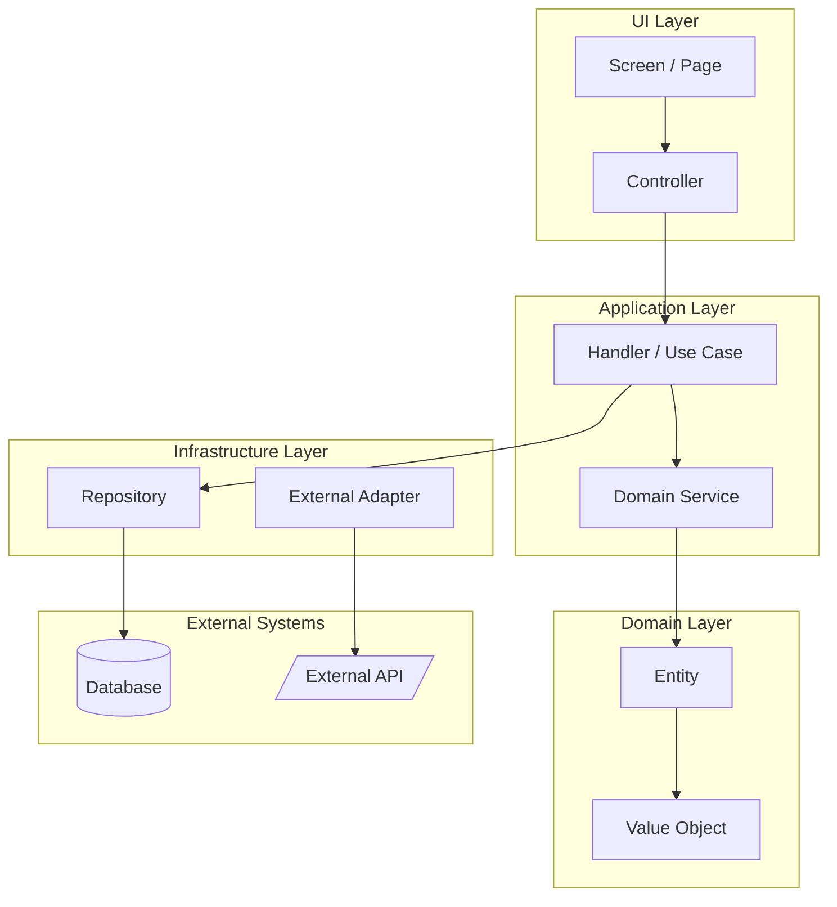
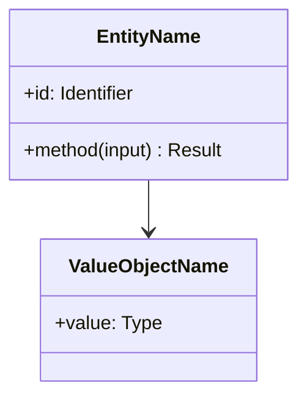
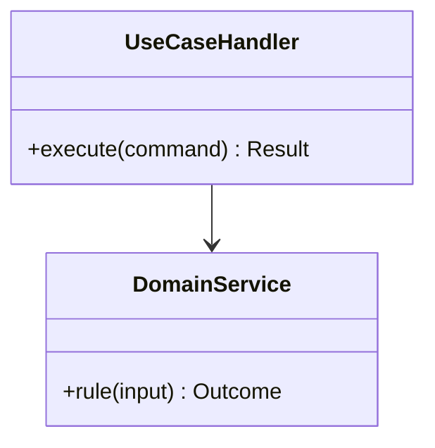
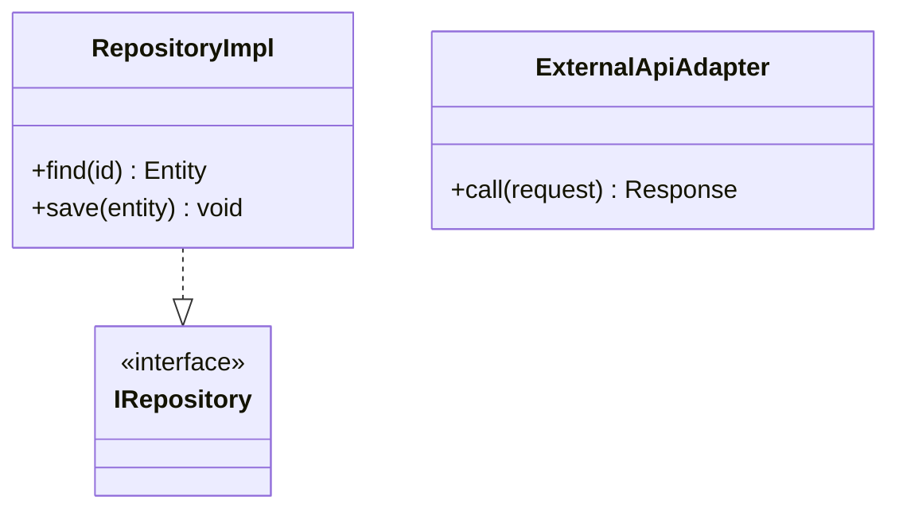
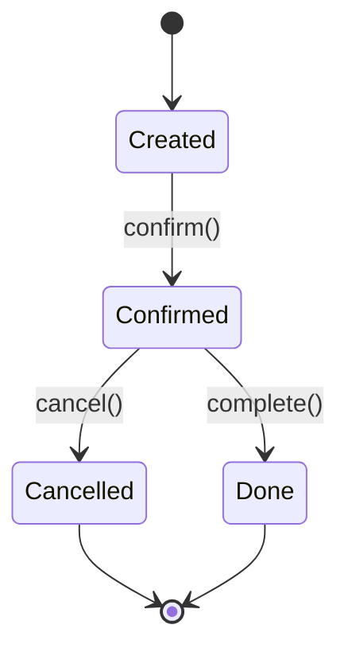

# [Project Name] — Architecture Specification

> Technical architecture, stack, structural model, class views, traceability, and quality gates. Functional behavior lives in `spec.md`. Visual decisions live in `design.md`.

## Architectural Style

This project follows **Herald Architecture**, adapted to the target language and stack. See `../shared/references/herald_architecture.md` for canonical principles.

Default principles:

- Readability over everything.
- Rich Domain Model.
- Entity never accesses infrastructure.
- Handler is a thin orchestrator.
- Polymorphism over type-based conditionals.
- Small functions.
- Constants for magic numbers.
- Explicit suffixes.
- Semantic folders.
- Immutability first.

## Stack

| Concern | Decision | Justification |
| --- | --- | --- |
| Language | TBD | TBD |
| Runtime | TBD | TBD |
| API | TBD | TBD |
| UI | TBD | TBD |
| Database | TBD | TBD |
| Messaging | TBD | TBD |
| Tests | TBD | TBD |
| Deploy | TBD | TBD |

## 1. Modelagem Estrutural Global (C4 Component)

> One Mermaid `flowchart TD` with `subgraph` per layer (UI / Application / Domain / Infrastructure / External). Each subgraph holds the components living there. Arrows show dependency direction; a Domain component never points outward to Infrastructure.



| ID | Name | Layer | Responsibility | Folder |
| --- | --- | --- | --- | --- |
| CMP-UI-001 | TBD | UI | TBD | `TBD` |
| CMP-APP-001 | TBD | Application | TBD | `TBD` |
| CMP-DOM-001 | TBD | Domain | TBD | `TBD` |
| CMP-INF-001 | TBD | Infrastructure | TBD | `TBD` |

### Layer Definitions

- **UI Layer:** TBD — entry surface (web/CLI/API). No business rule.
- **Application Layer:** TBD — orchestrators, handlers, transaction boundaries.
- **Domain Layer:** TBD — entities, value objects, domain services, invariants.
- **Infrastructure Layer:** TBD — persistence, external adapters, message buses, security.
- **External Systems:** TBD — databases, third-party APIs, queues.

## 2. Diagrama de Classes Detalhado (per layer)

> One independent `classDiagram` block per layer. Never a single monolith. Show fields, methods (signatures only), associations, and dependencies.

### 2.1 Visão Domain



| ID | Symbol | Maps To | Layer | Responsibility | Folder |
| --- | --- | --- | --- | --- | --- |
| CLS-DOM-001 | EntityName | BE-001 | Domain | TBD | `TBD` |
| VO-DOM-001 | ValueObjectName | BE-002 | Domain | TBD | `TBD` |

### 2.2 Visão Application



| ID | Symbol | Layer | Responsibility | Folder |
| --- | --- | --- | --- | --- |
| CLS-APP-001 | UseCaseHandler | Application | TBD | `TBD` |
| CMD-APP-001 | UseCaseCommand | Application | TBD | `TBD` |
| IF-APP-001 | RepositoryPort | Application | TBD | `TBD` |

### 2.3 Visão Infrastructure



| ID | Symbol | Layer | Responsibility | Folder |
| --- | --- | --- | --- | --- |
| CLS-INF-001 | RepositoryImpl | Infrastructure | TBD | `TBD` |
| CLS-INF-002 | ExternalApiAdapter | Infrastructure | TBD | `TBD` |

## 3. Matriz de Rastreabilidade (UC → Components)

> Map every functional Use Case from `spec.md` to the components/classes/namespaces from sections 1 and 2. No UC may be left unmapped.

| Use Case | Layer(s) | Component(s) / Class(es) | Namespace / Folder |
| --- | --- | --- | --- |
| UC-001 | UI, Application, Domain | CMP-UI-002, CMP-APP-001, CLS-APP-001, CMP-DOM-001, CLS-DOM-001 | `app/uc-001/`, `domain/` |

## 4. Diagrama de Transições de Estado

> Include this section only when at least one entity has a non-trivial lifecycle. Use one `stateDiagram-v2` block per entity with states.



## Herald Adaptation

Describe how Herald principles map to this language and stack. Examples per language:

- Records/sealed/dataclasses for immutable DTOs.
- Encapsulated rich entities with private state and intention-revealing methods.
- Use-case handlers as thin orchestrators returning Result-like outcomes.
- Repositories behind interfaces declared in the Domain or Application layer.
- Infrastructure adapters living only at the Infrastructure layer.

Document any deviation from Herald defaults and the reason.

## Project Structure

```text
TBD
```

## Allowed Folders

- TBD

## Banned Folders

- Data
- Database
- Network
- Http
- Util
- Common
- Models
- Dto
- Core

## NFRs

| ID | Quality Attribute | Requirement | Verification |
| --- | --- | --- | --- |
| NFR-001 | Performance | TBD | TBD |
| NFR-002 | Availability | TBD | TBD |
| NFR-003 | Security | TBD | TBD |

## Commands

```text
build: TBD
test: TBD
lint: TBD
run: TBD
```

## Quality Gates

- QG-001: Domain entities do not access infrastructure.
- QG-002: Handlers orchestrate and return Result-like outcomes where applicable.
- QG-003: Commands and queries are immutable DTOs for the language.
- QG-004: Files are inside allowed folders.
- QG-005: Banned folders are not introduced.
- QG-006: Verify commands pass.
- QG-007: Class diagrams in section 2 are split by layer (no monolithic Mermaid block).
- QG-008: Every UC in `spec.md` has a row in the Traceability Matrix.
- QG-009: Production files listed in backlog stories map to Architecture Refs through `Implementation Targets`.

## ADRs

### ADR-001 — Initial Architecture

**Status:** accepted

**Context:** TBD

**Decision:** TBD

**Consequences:** TBD
