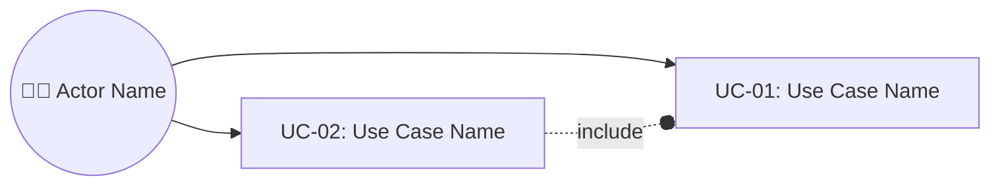

# [Project Name] — Specification

> Functional product specification. Implementation decisions, NFRs, stack, folder layout, and quality gates live in `architecture.md`. Visual decisions live in `design.md`.

## Overview

One short paragraph summarizing what the product is, the business outcome, who uses it, and the high-level boundary (e.g. "Sistema web responsivo para X. Escopo: N telas operacionais. M perfis de acesso. Cadastro Y standalone, sem integração Z.").

## Scope

### In Scope

- TBD

### Out Of Scope

- TBD

## Actors

| ID | Actor | Type | Responsibility |
| --- | --- | --- | --- |
| ACT-001 | TBD | Human \| System \| External | TBD |

## Use Cases

### Use Case Diagram

### Use Case Matrix

| ID | Name | Actor | Summary | Has UI |
| --- | --- | --- | --- | --- |
| UC-001 | TBD | ACT-001 | TBD | yes \| no \| partial |

## Use Case Details

> One drill-down per UC in the matrix above. Mandatory structure: Actor, Preconditions, Main Flow (UC-XXX.FP, numbered), Alternative Flows (UC-XXX.FA1, FA2, ..., each numbered), Postconditions.

### UC-001 — TBD

**Actor:** ACT-001

**Preconditions**

- TBD

**Main Flow (UC-001.FP)**

1. TBD

**Alternative Flows**

- **UC-001.FA1 (TBD):**
  1. TBD

**Postconditions**

- TBD

## Business Rules

- BR-001: TBD

## Invariants

- INV-001: TBD

## Business Entities

| Entity | Type | Definition |
| --- | --- | --- |
| TBD | Domain \| Actor \| External \| Value Object | TBD |

## Functional Acceptance Criteria

> Functional outcomes, not implementation gates. Use plain criteria by default. EARS notation (`WHEN ... THE SYSTEM SHALL ...`, `WHILE ...`, `IF ... THEN ...`, `WHERE ...`) is optional — adopt only when the user requests it or the domain is regulated/audit-heavy. Anchor each AC to a UC when possible (e.g. "AC linked to UC-001").

- AC-001: GIVEN TBD WHEN TBD THEN TBD.

## Spikes

> Include this section only when there is unresolved technical discovery that affects feasibility, architecture, backlog order, integration risk, cost, or delivery. Each spike must declare a Research Question and Deliverables (`DEL-*`).

- SP-001: TBD
  - Research Question: TBD
  - Deliverables: DEL-001, DEL-002

## Assumptions

- TBD

## Open Questions

- TBD
